# Valley Drive

> **Event‑Driven Data Collection & Real‑Time Streaming for Autonomous Driving**

Valley Drive 是一个基于 **共享内存发布‑订阅** 和 **事件驱动执行器** 的高性能数据流框架，专为 **自动驾驶** 等强实时、多进程场景设计。它通过 **双模式读取**（`read_latest` 与 `catch_up`）在同一数据通道上同时满足 **低延迟实时响应** 与 **高可靠数据归档**，并通过 **配置驱动** 和 **周期性实时线程** 实现模块化、可扩展的系统编排。

---

## 🚗 设计动机

在自动驾驶系统中：
- **规划/控制模块** 必须基于 **最新** 的感知与定位结果做出决策，**旧数据必须丢弃**，否则会导致反应滞后甚至碰撞。
- **数据收集/调试模块** 则要求 **完整记录所有原始数据与中间结果**，用于事故回放与算法调优，**一条都不能丢**。
- **多传感器异构**：相机、激光雷达、GPS/IMU 频率不同，需独立处理。
- **跨进程通信**：不同模块可能运行在不同进程中，需要零拷贝、低延迟的 IPC 机制。
- **任务触发**：算法节点应按事件（如新数据到达）触发执行，并具备异常隔离与恢复能力。

Valley Drive 通过以下设计应对这些需求：
- **共享内存 Channel**：支持多进程发布/订阅，数据零拷贝传输。
- **双模式游标**：每个订阅者独立维护读取位置，自由选择 `latest` 或 `catch_up`。
- **Executor + Notification**：将数据收集封装为独立任务，通过 `Notification` 事件驱动执行。
- **周期性实时线程**：使用 `thread::start_cyclic` 创建高精度、低抖动的生产者和消费者循环。
- **JSON 配置驱动**：声明式定义通道、订阅者、执行器及任务，便于大规模部署。

---

## 🧱 架构概览

```mermaid
graph TD
    subgraph ConfigLayer["Configuration Layer"]
        Config[JSON Config] --> Init[conf::initialize]
    end

    subgraph CommLayer["Communication Layer"]
        Init --> ChPose["/sensor/pose"]
        Init --> ChCam["/sensor/camera"]
        Init --> ChLidar["/sensor/lidar"]
        Init --> ChTraj["/trajectory"]
        Init --> ChCtrl["/control"]

        ChPose --> PubPose[Publisher]
        ChPose --> SubRealtimePose["Sub: realtime"]
        ChPose --> SubCollectPose["Sub: collector"]

        ChCam --> PubCam[Publisher]
        ChCam --> SubRealtimeCam["Sub: realtime"]
        ChCam --> SubCollectCam["Sub: collector"]

        ChLidar --> PubLidar[Publisher]
        ChLidar --> SubRealtimeLidar["Sub: realtime"]
        ChLidar --> SubCollectLidar["Sub: collector"]

        ChTraj --> PubTraj[Publisher]
        ChTraj --> SubCtrlTraj["Sub: trajectory"]
        ChTraj --> SubCollectTraj["Sub: collector"]

        ChCtrl --> PubCtrl[Publisher]
        ChCtrl --> SubCollectCtrl["Sub: collector"]
    end

    subgraph ExecLayer["Execution Layer"]
        Exec["Executor: /collector"] --> TaskPose[collect_pose]
        Exec --> TaskCam[collect_cam]
        Exec --> TaskLidar[collect_lidar]
        Exec --> TaskTraj[collect_traj]
        Exec --> TaskCtrl[collect_ctrl]

        NotifyPose["Notify: collect_pose"] -.->|emit| Exec
        NotifyCam["Notify: collect_cam"] -.->|emit| Exec
        NotifyLidar["Notify: collect_lidar"] -.->|emit| Exec
        NotifyTraj["Notify: collect_traj"] -.->|emit| Exec
        NotifyCtrl["Notify: collect_ctrl"] -.->|emit| Exec
    end

    subgraph RealTime["Real‑Time Threads"]
        T1["Pose (100Hz)"] -->|write + emit| PubPose
        T2["Camera (20Hz)"] -->|write + emit| PubCam
        T3["Lidar (10Hz)"] -->|write + emit| PubLidar
        T4["Planning (10Hz)"] -->|read_latest| SubRealtimePose
        T4 -->|read_latest| SubRealtimeCam
        T4 -->|read_latest| SubRealtimeLidar
        T4 -->|write + emit| PubTraj
        T5["Control (50Hz)"] -->|read_latest| SubCtrlTraj
        T5 -->|write| PubCtrl
    end

    subgraph CollectThread["Collector Thread"]
        Collector["Collector Thread"] -->|run| Exec
        TaskPose -->|catch_up| SubCollectPose
        TaskCam -->|catch_up| SubCollectCam
        TaskLidar -->|catch_up| SubCollectLidar
        TaskTraj -->|catch_up| SubCollectTraj
        TaskCtrl -->|catch_up| SubCollectCtrl
    end
```



实时链路（实线）：所有生产者和消费者使用 read_latest() 保证低延迟。

收集链路（虚线）：每个数据源有独立的 Notification，触发对应的 catch_up 任务，实现事件驱动归档。

## ✨ 核心特性
双模式读取：同一 Channel 支持 latest 和 catch_up 两种订阅策略。

共享内存通信：跨进程、零拷贝，支持大数据块（如图像、点云）高效传输。

事件驱动收集：每个数据源独立触发收集任务，按需唤醒，CPU 利用率更高。

多任务执行器：一个 Executor 可管理多个收集任务，每个任务处理特定数据类型。

周期性实时线程：thread::start_cyclic 提供高精度、低抖动的循环调度，支持实时优先级。

配置声明式：JSON 定义通道、订阅者、执行器及任务，支持动态加载。

异常安全：Executor::run() 捕获任务异常，保证调度循环继续运行。

多线程安全：所有组件均为线程安全设计，无额外锁竞争（内部采用无锁结构）。

轻量级 C++11：仅依赖标准库，无外部框架。

## 🧪 快速开始
以下代码片段展示了如何配置并启动一个包含 定位、相机、激光雷达 的实时采集与收集系统。

1. 定义数据结构（POD，可跨进程）
```cpp
struct SensorData { double value; uint64_t seq; };
struct PoseData   { double x, y, z, yaw; uint64_t seq; };
struct LidarPointCloud { uint64_t seq; float points[64][3]; };
struct Trajectory { double target_x[10]; double target_y[10]; uint64_t seq; };
struct ControlCmd { double steer; double throttle; uint64_t seq; };
```
2. 编写 JSON 配置
```json
{
    "application": "ValleyDrive",
    "channel": [
        {"name": "/sensor/pose",   "subscriber": ["realtime", "collector"]},
        {"name": "/sensor/camera", "subscriber": ["realtime", "collector"]},
        {"name": "/sensor/lidar",  "subscriber": ["realtime", "collector"]},
        {"name": "/trajectory",    "subscriber": ["trajectory", "collector"]},
        {"name": "/control",       "subscriber": ["control", "collector"]}
    ],
    "executor": [
        { "name": "/collector", 
          "task": ["collect_pose", "collect_cam", "collect_lidar", "collect_traj", "collect_ctrl"]}
    ]
}
```
3. 初始化框架，创建组件
```cpp
#include "valley/conf/conf.h"
#include "valley/shm/channel.h"
#include "valley/exec/executor.h"
#include "valley/exec/notification.h"
#include "valley/thread/thread.h"

conf::initialize(kConfig, conf::Model::kBoth);

auto ch_pose  = shm::Channel("/sensor/pose");
auto pub_pose = shm::Channel::Publisher(ch_pose);
auto sub_realtime_pose = shm::Channel::Subscriber(ch_pose, "realtime");
auto sub_collect_pose  = shm::Channel::Subscriber(ch_pose, "collector");

// 创建 Executor 和 Notification（每个数据源独立）
exec::Executor collector_exe("/collector", {
    {"collect_pose", [&]() { sub_collect_pose.catch_up<PoseData>([](const PoseData*){}); }},
    // ... 其他任务
});
exec::Notification nty_pose("/collector", "collect_pose");
```
4. 启动周期性生产者线程（100Hz）
```cpp
thread::Option option;
option.set_priority_realtime();
auto start_timepoint = thread::now();

std::thread producer_pose = thread::start_cyclic(
    option,
    g_stop,
    start_timepoint,
    std::chrono::milliseconds(10), // 周期
    [&]() {
        PoseData pose{};
        // 填充数据...
        pub_pose.write(pose);
        nty_pose.emit();   // 触发收集
    }
);
```
5. 启动收集线程（事件驱动）
```cpp
std::thread collector_thread([&]() {
    while (!g_stop) {
        try {
            collector_exe.run(g_stop); // 阻塞等待任一 Notification
        } catch (...) { /* 恢复 */ }
    }
});
```
6. 运行与退出
```cpp
std::this_thread::sleep_for(std::chrono::seconds(10));
g_stop = true;
// join 所有线程...
完整示例可参考 examples/valley_drive/main.cpp。
```

## 📁 目录结构
```text
vIPC/
├── valley/
│   ├── conf/                 # 配置管理
│   │   ├── conf.h
│   │   └── ...
│   ├── shm/                  # 共享内存 Channel（跨进程）
│   │   └── channel.h
│   ├── exec/                 # 执行器与通知
│   │   ├── executor.h
│   │   └── notification.h
│   ├── thread/               # 实时线程工具（周期性循环）
│       └── thread.h
└── examples/
    └── valley_drive/ # 完整示例（含配置、共享内存、Executor）
        ├── main.cpp
        └── README.md
```
## 🔧 核心组件详解
**shm::Channel**
基于共享内存的环形缓冲区，支持多进程读写。

每个 Channel 有唯一名称（如 /sensor/pose）。

同一名称的 Channel 全局唯一，重复创建会返回无效对象。

每个 Channel 允许 一个 Publisher 和 多个 Subscriber（由名称区分）。

**exec::Executor**
管理多个命名任务，每个任务是一个 std::function<void()>。

run(stop_flag) 阻塞等待任何关联的 Notification 被触发，然后执行对应的任务。

任务抛出的异常会被 run() 捕获并重新抛出，调用方可处理。

**exec::Notification**
绑定到特定的 (Executor, Task) 对。

emit() 唤醒对应的 Executor，使其执行绑定的任务。

若绑定无效，operator bool 返回 false。

**thread::start_cyclic**
创建周期执行的线程，支持实时优先级。

自动处理 g_stop 退出条件，保证优雅关闭。

返回 std::thread 对象，可 join。

## 📄 许可证
本项目（含所有示例代码）遵循 MIT License。

## 🤝 贡献
欢迎提交 Issue 和 Pull Request。请确保代码风格与现有代码一致，并添加相应的单元测试。

## 📫 联系与交流
如有任何问题、建议，或希望参与学习交流，欢迎发送邮件至：
191954202@qq.com (gus)

Valley Drive – 让实时与可靠并存